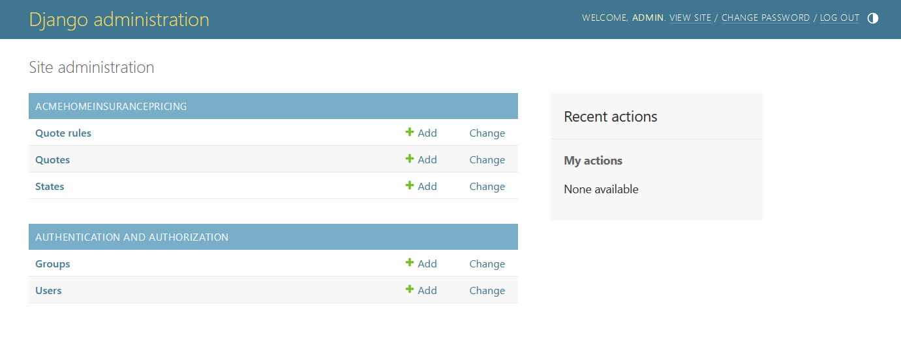
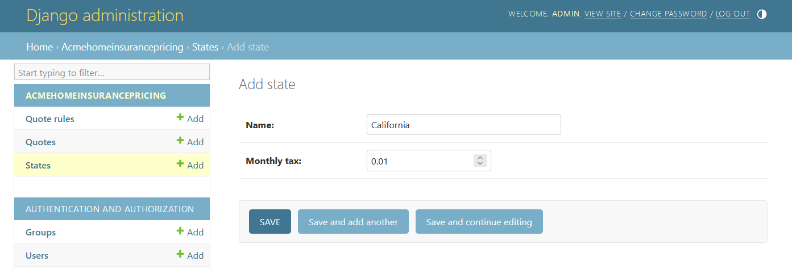
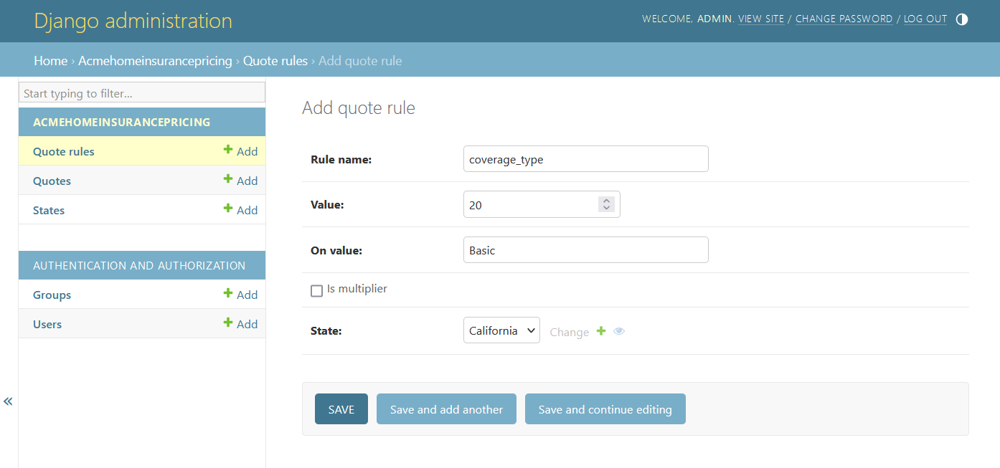
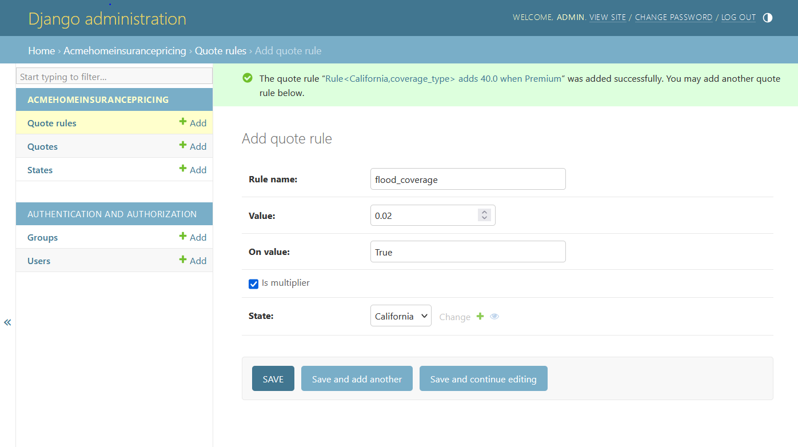

<a name="readme-top"></a>

<!-- PROJECT LOGO -->
<br />
<div align="center">
  

<h3 align="center">ACME Home Insurance</h3>

  <p align="center">
    Flexible pricing algorithm API for home insurance. 
  </p>
</div>

<!-- TABLE OF CONTENTS -->
<details>
  <summary>Table of Contents</summary>
  <ol>
    <li>
      <a href="#about-the-project">About The Project</a>
    </li>
    <li>
      <a href="#getting-started">Getting Started</a>
      <ul>
        <li><a href="#prerequisites">Prerequisites</a></li>
        <li><a href="#configuration">Configuration</a></li>
      </ul>
    </li>
    <li>
        <a href="#usage">Usage</a>
        <ul>
          <li><a href="#submit-a-quote">Submit a Quote</a></li>
          <li><a href="#get-a-quote">Get a Quote</a></li>
        </ul>
    </li>
    <li><a href="#testing">Testing</a></li>
    <li><a href="#contact">Contact</a></li>
  </ol>
</details>

<!-- ABOUT THE PROJECT -->

## About The Project

ACME Home Insurance's API for users to submit and retrieve their quotes. While ACME Home Insurance currently insures homeowners in a select number of states, this API is designed to grow as they do. Add new states, coverage types, or types of insurance (ex: volcano insurance).

<p align="right">(<a href="#readme-top">back to top</a>)</p>

<!-- GETTING STARTED -->

## Getting Started

### Prerequisites

This API uses Django and Python3. To install the necessary packages, first create and activate a python virtual environment.

```sh
python3 -m venv .env
```

- On OSX:

```sh
. .env/bin/activate
```

- On Windows:

```sh
. .\.env\Scripts\activate
```

Now, install the necessary packages with pip.

```sh
pip install -r requirements.txt
```

Let's use django's commandline interface to set up the database:

```sh
python manage.py migrate
```

Once the database has been setup, create a super user to manage it.

```sh
python manage.py createsuperuser
```

Once the prompts have been followed to enter the user's username, email, and password, let's start the server.

```sh
python manage.py runserver
```

### Configuration

Travel to `http://localhost:8000/admin` and enter the requested credentials. This will direct you to the admin home page.
<br/><br/>

<br/><br/>
To start, click on "States" to add a state.
Let's add California with a monthly tax rate of 1%. Since adding "1" to "Monthly tax" would equate to 100% tax rate, let's add 0.01.
<br/><br/>

<br/><br/>
Once "Save" is clicked, a new state has been added to the database.
Now let's navigate to the Quote Rules section and click "ADD QUOTE RULE" at the top.
<br/><br/>

<br/><br/>
Here we have three important fields:

1. <b>Rule name</b>: The snake-case version of the insurance rule/type requested. Ex: flood coverage would be flood_coverage.
2. <b>Value</b>: This is the amount that will be added or multiplied to the subtotal.
3. <b>On value</b>: <i>Value</i> will be applied to the running subtotal when a user requests a <i>rule name</i> with the same <i>on value</i>. Ex: $20 is applied to the subtotal when a user requests a Basic coverage type over Premium.
4. <b>Is multiplier</b>: Click this if the <i>value</i> should be multiplied to the running subtotal at the end of the calculation. Ex: If a user requests flood coverage, multiply the subtotal by the <i>value</i> amount after everything has been added.
5. <b>State</b>: Select the state in which this should be applied to. Click the + next to the dropdown to add a state.

Click "Save and add another" to add coverage for Premium insurance. Below is an example of adding the above flood coverage rule:
<br/><br/>

<br/><br/>
Here, the flood coverage for California increases the subtotal by 2%, which is applied at the end of calculation when the user sends "True". When entering a boolean value, the value must start with a capital letter.
<br/>
Note that updating or creating new quote rules or states can be done without restarting the server.

<p align="right">(<a href="#readme-top">back to top</a>)</p>

<!-- USAGE EXAMPLES -->

## Usage

The API can be used to submit quotes and get previously submitted quotes.

### Submit a Quote

To submit a quote to the API, send the request to the `quotes/submit` endpoint:

```cURL
curl --location 'http://localhost:8000/quotes/submit' \
--header 'Content-Type: application/json' \
--data '{
    "owner_name": "John Smith",
    "state": "California",
    "coverage_type": "Premium",
    "flood_coverage": true,
    "has_pet": true
}'
```

Owner name and state are required when submitting quote. coverage_type, flood_coverage, and has_pet were set up under the `Quote Rules` section of the admin homepage.
This returns a 200 response with the following body:

```json
{
  "monthly_subtotal": 61.2,
  "monthly_taxes": 0.612,
  "monthly_total": 61.812,
  "rules": {
    "state": "California",
    "coverage_type": "Premium",
    "flood_coverage": true,
    "has_pet": true,
    "monthly_taxes": 0.01
  },
  "owner_name": "John Smith",
  "quote_id": 3
}
```

The returned <b>quote_id</b> can be used to retreive the submitted quote at a later time.

<p align="right">(<a href="#readme-top">back to top</a>)</p>

### Get a Quote

To get a previously submitted quote, such as in the above example, a request can be sent to the `quotes/<quote_id>` route, where <b>quote_id</b> is the returned <b>quote_id</b> above:

```cURL
curl --location 'http://localhost:8000/quotes/3'
```

The request will give us a response with all the rules requested at the time of creation:

```json
{
  "monthly_subtotal": 61.2,
  "monthly_taxes": 0.612,
  "rules": {
    "state": "California",
    "coverage_type": "Premium",
    "flood_coverage": true,
    "has_pet": true,
    "monthly_taxes": 0.01
  },
  "owner_name": "John Smith",
  "monthly_total": 61.812,
  "quote_id": 3
}
```

<p align="right">(<a href="#readme-top">back to top</a>)</p>

<!-- Testing -->

## Testing

Unit tests are split up into four groups: `TestModels`, `TestShared`, `TestUrls`, and `TestViews`.
To run tests from all four groups, enter the following into the terminal:

```sh
python manage.py test acmeHomeInsurancePricing
```

To run tests only on views:

```sh
python manage.py test acmeHomeInsurancePricing.tests.TestViews
```

<p align="right">(<a href="#readme-top">back to top</a>)</p>

<!-- CONTACT -->

## Contact

Toby Wiedenhoefer - toby.wiedenh@gmail.com

LinkedIn: [https://www.linkedin.com/in/tobywiedenhoefer/](https://www.linkedin.com/in/tobywiedenhoefer/)

<p align="right">(<a href="#readme-top">back to top</a>)</p>
